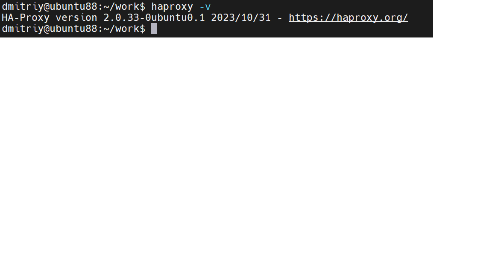
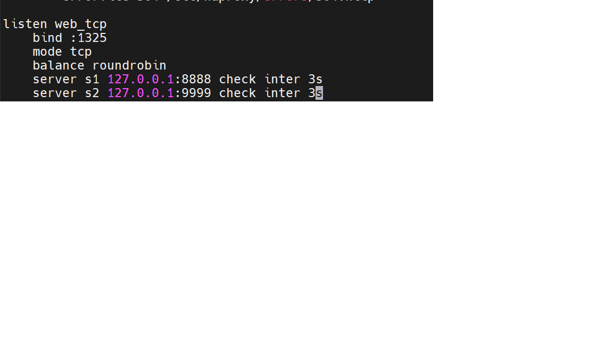
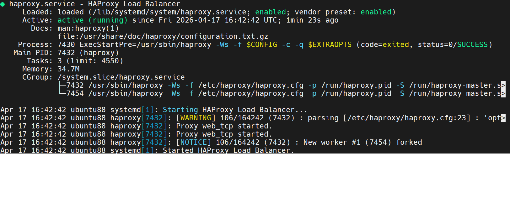
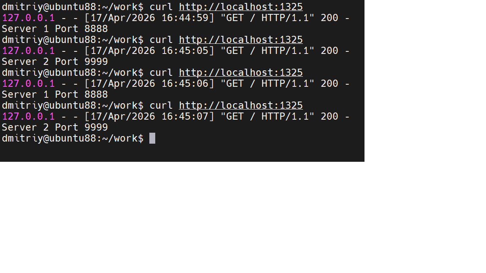
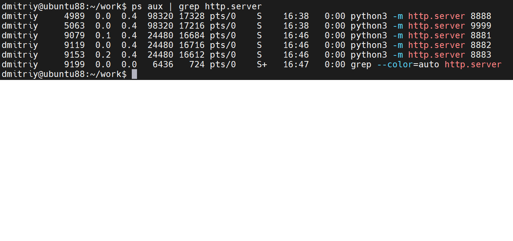
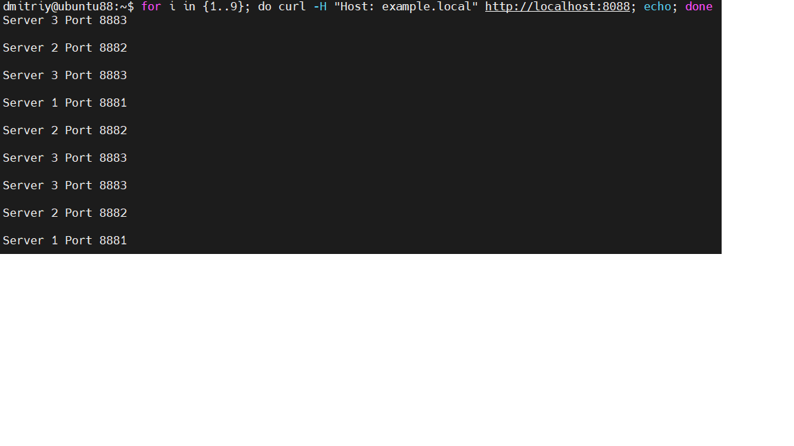
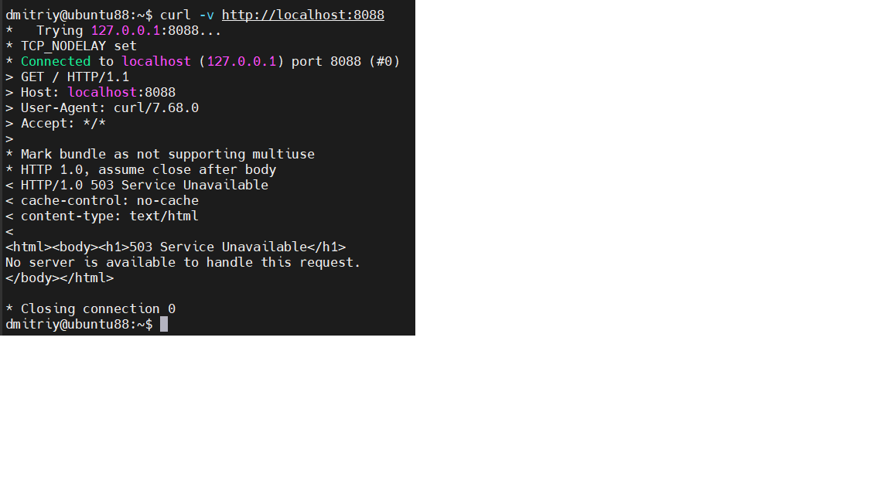
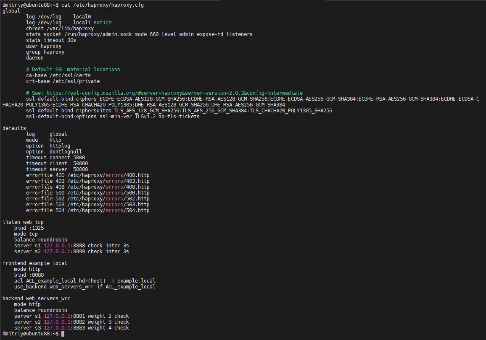

# Кластеризация и балансировка нагрузки

## Задание 1 — Round Robin балансировка на 4 уровне (TCP)

**Два сервера запущены (8888, 9999)**

**Версия HAProxy**

**Конфиг listen web_tcp (TCP, Round-Robin)**

**HAProxy active (running)**

**Чередование серверов curl :1325**

## Задание 2 — Weighted Round Robin на 7 уровне (HTTP), домен example.local

**5 серверов запущены (8881, 8882, 8883)**

**WRR с доменом example.local**

**503 без домена**

**Конфигурационный файл haproxy.cfg**

